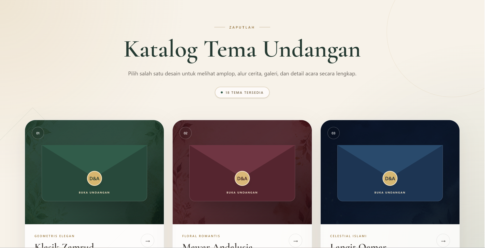
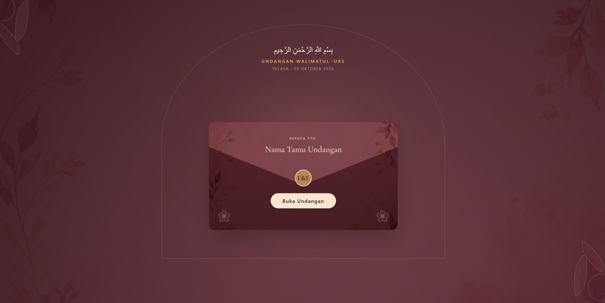
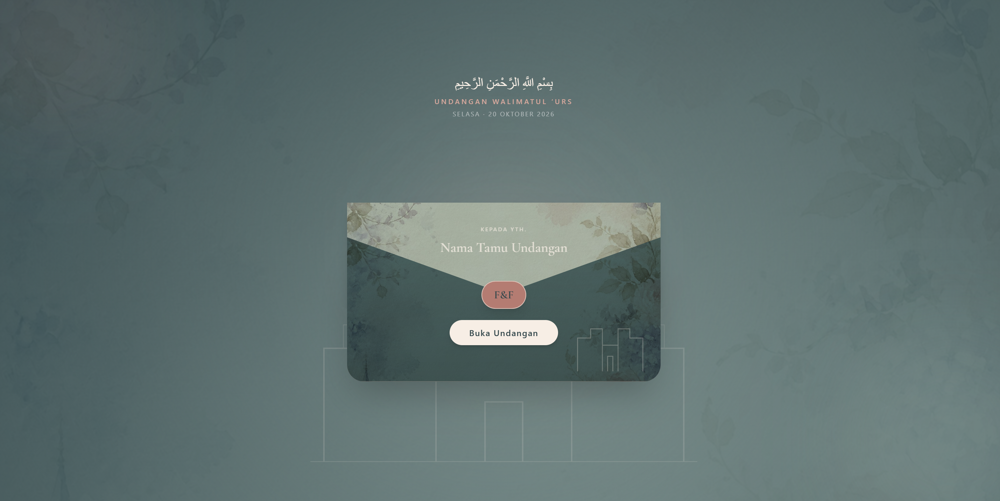
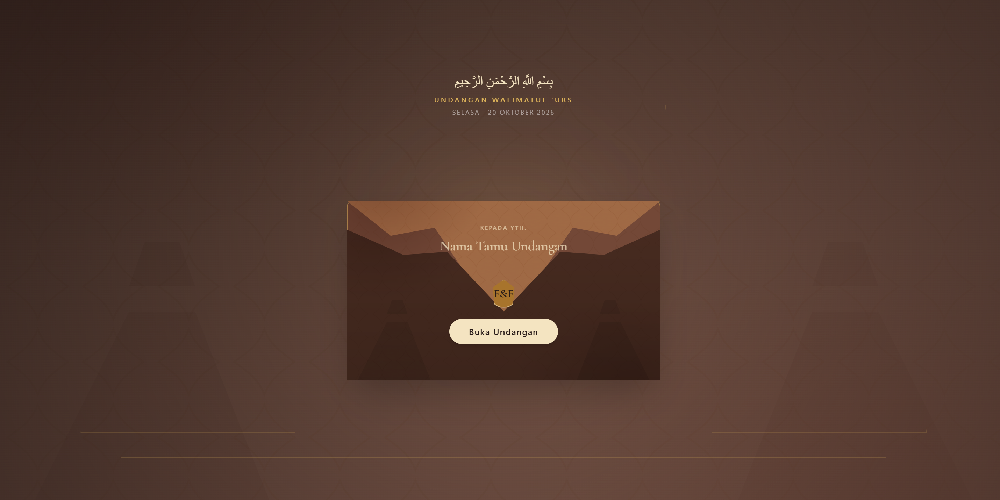
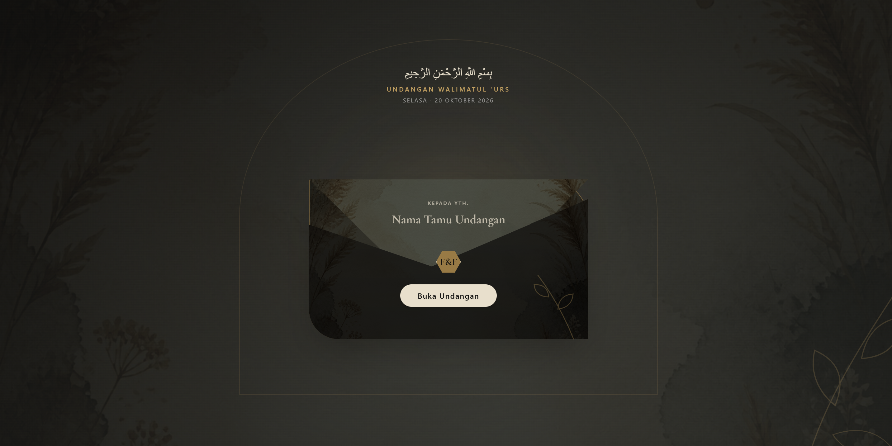

# Weding — Undangan Pernikahan Digital

Aplikasi undangan pernikahan digital berbasis Angular dengan katalog tema, halaman undangan personal, galeri, cerita perjalanan pasangan, hitung mundur acara, dan petunjuk lokasi.

Proyek ini berjalan sepenuhnya di sisi klien. Tidak ada backend, database, RSVP, daftar tamu Excel, atau halaman admin. Nama tamu dan tema yang dipilih hanya disimpan di `localStorage` browser.

## Fitur

- Katalog berisi 18 tema undangan.
- Halaman undangan responsif untuk desktop dan perangkat seluler.
- URL personal berdasarkan tema dan nama pelanggan.
- Validasi undangan serta masa berlaku pelanggan.
- Sampul interaktif dengan nama tamu.
- Hitung mundur menuju hari pernikahan.
- Profil kedua mempelai dan kutipan ayat.
- Galeri foto dengan tampilan yang mengikuti tema.
- Cerita perjalanan dari taaruf hingga akad.
- Informasi akad dan walimah, tautan Google Maps, serta kode QR lokasi.
- Navigasi seluler dan animasi berbasis posisi scroll.
- Halaman fallback untuk URL atau undangan yang tidak tersedia.

## Pratinjau aplikasi

### Katalog tema

<p align="center">
  
</p>

### Contoh tema

<table>
  <tr>
    <td align="center" width="50%">
      
      <br />
      <strong>Mawar Andalusia</strong>
    </td>
    <td align="center" width="50%">
      
      <br />
      <strong>Château Watercolor</strong>
    </td>
  </tr>
  <tr>
    <td align="center" width="50%">
      
      <br />
      <strong>Bali Agung</strong>
    </td>
    <td align="center" width="50%">
      
      <br />
      <strong>Dark Boho</strong>
    </td>
  </tr>
</table>

## Teknologi

- Angular 21
- TypeScript 5.9
- Tailwind CSS 4
- PostCSS
- RxJS
- npm

## Persyaratan

Pastikan Node.js versi LTS dan npm sudah terpasang. Periksa dengan:

```bash
node --version
npm --version
```

## Instalasi

Clone repository, masuk ke folder proyek, lalu instal dependensi:

```bash
git clone https://github.com/Zaputlah/weding.git
cd weding
npm install
```

Jika proyek sudah tersedia di komputer, cukup jalankan `npm install` dari folder proyek.

## Menjalankan aplikasi

```bash
npm start
```

Buka `http://localhost:4200` di browser. Angular akan memuat ulang halaman secara otomatis ketika source code berubah.

## Daftar rute

| Rute | Keterangan |
| --- | --- |
| `/` | Katalog seluruh tema undangan |
| `/undangan/:themeId` | Pratinjau undangan berdasarkan tema |
| `/undangan/:themeId/:customerSlug` | Undangan personal pelanggan |
| `/undangan` | Halaman tidak tersedia |
| `/halaman-tidak-tersedia` | Halaman fallback |

Contoh URL pratinjau:

```text
http://localhost:4200/undangan/mawar-andalusia
```

Contoh URL pelanggan:

```text
http://localhost:4200/undangan/mawar-andalusia/andiani-putra
```

## Menambah undangan pelanggan

Data pelanggan berada di `src/app/invitation-access.ts`. Tambahkan objek baru ke dalam `CUSTOMER_INVITATIONS`:

```ts
{
  themeSlug: 'mawar-andalusia',
  customerSlug: 'nama-pelanggan',
  coupleName: 'Nama Mempelai Wanita & Nama Mempelai Pria',
  brideFullName: 'Nama Lengkap Mempelai Wanita',
  groomFullName: 'Nama Lengkap Mempelai Pria',
  expiresAt: '2027-01-31T23:59:59+07:00',
},
```

Ketentuan field:

- `themeSlug`: harus sama dengan slug tema yang tersedia.
- `customerSlug`: bagian unik pada URL pelanggan; gunakan huruf kecil dan tanda hubung.
- `coupleName`: nama singkat pasangan yang tampil pada undangan.
- `brideFullName` dan `groomFullName`: nama lengkap masing-masing mempelai.
- `expiresAt`: batas waktu akses dalam format ISO 8601 beserta zona waktu.

Undangan baru kemudian dapat dibuka melalui:

```text
/undangan/{themeSlug}/{customerSlug}
```

## Kustomisasi

File utama yang biasa disesuaikan:

| File | Fungsi |
| --- | --- |
| `src/app/invitation/invitation.ts` | Data tema, pasangan, acara, galeri, perjalanan, lokasi, dan perilaku halaman |
| `src/app/invitation/invitation.html` | Struktur serta tampilan halaman undangan |
| `src/app/theme-catalog/theme-catalog.ts` | Daftar tema pada halaman katalog |
| `src/app/invitation-access.ts` | Daftar pelanggan dan masa berlaku undangan |
| `src/app/app.routes.ts` | Konfigurasi URL aplikasi |
| `src/styles.css` | Style global dan konfigurasi Tailwind CSS |
| `public/assets` | Gambar, ilustrasi, favicon, dan kode QR |

Saat mengganti lokasi acara, perbarui `locationUrl` di `invitation.ts` dan ganti `public/assets/qr-lokasi-undangan.png` agar keduanya mengarah ke lokasi yang sama.

## Perintah npm

| Perintah | Fungsi |
| --- | --- |
| `npm start` | Menjalankan development server |
| `npm run build` | Membuat production build |
| `npm run watch` | Build mode development dan memantau perubahan |
| `npm test` | Menjalankan unit test |

## Production build

```bash
npm run build
```

Hasil build berada di:

```text
dist/undangan-app/browser
```

Folder tersebut dapat diunggah ke layanan hosting statis seperti Netlify, Vercel, GitHub Pages, atau web hosting biasa. Karena aplikasi menggunakan Angular Router, hosting perlu diarahkan untuk mengembalikan `index.html` ketika pengguna membuka URL undangan secara langsung.

## Struktur proyek

```text
public/
  assets/                         Aset gambar dan ilustrasi
src/
  app/
    customer-invitation-page/     Validasi halaman pelanggan
    invitation/                   Halaman utama undangan
    theme-catalog/                Katalog tema
    unavailable-page/             Halaman fallback
    app.routes.ts                 Daftar rute
    invitation-access.ts          Data akses pelanggan
  index.html
  main.ts
  styles.css
```

## Menyimpan perubahan ke GitHub

```bash
git add .
git commit -m "docs: lengkapi dokumentasi proyek"
git push
```

## Catatan privasi

Aplikasi tidak mengirimkan nama tamu ke server. Nama yang dimasukkan pada sampul hanya digunakan untuk personalisasi tampilan dan disimpan secara lokal di browser pengguna.
